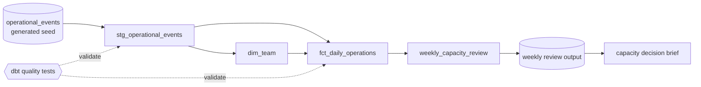

# Operations Analytics with dbt

A compact, interview-ready analytics-engineering exercise based on familiar
operational planning questions. It uses deliberately small sample data; it is not
employer work and contains no confidential information.

## Business question

How can an operations team monitor daily demand, completed work, closing backlog,
throughput per staffed hour and SLA risk using definitions that are documented and
tested once rather than recreated in every dashboard?

## What the project demonstrates

- staging and type-cleaning a raw operational seed;
- a simple star-schema pattern with a team dimension and daily operations fact;
- documented metric definitions;
- a field-level data dictionary with model grain and interpretation notes;
- generic and singular data-quality tests, including non-null checks on
  decision-facing team attributes and SLA-rate boundary checks;
- backlog continuity validation between consecutive team observations;
- a decision-focused weekly review query;
- a short management brief translating the generated query output into actions.

## Model flow



The staging layer standardises the source fields. The dimension and fact models
create reusable reporting structures, tests validate both layers, and the weekly
analysis feeds a concise operational recommendation.

## Five-minute code tour

1. Start with `seeds/operational_events.csv` to understand the grain.
2. Read `models/staging/stg_operational_events.sql` for type and naming cleanup.
3. Read `models/marts/fct_daily_operations.sql` for the metric logic.
4. Use `DATA_DICTIONARY.md` to review grain, field definitions and aggregation rules.
5. Read `models/marts/marts.yml`, `tests/assert_valid_operational_balance.sql`,
   `tests/assert_valid_sla_breach_rate.sql` and
   `tests/assert_backlog_continuity.sql` for the quality rules.
6. Read `analyses/weekly_capacity_review.sql`, then compare its output with
   `results/WEEKLY_CAPACITY_BRIEF.md` to see how the model supports a decision.

## Result

The generated example shows a roughly 6% increase in weekly demand while total
completions keep pace. The combined SLA-breach rate still rises from 3.66% to
4.36%, and Team Cedar records the only pressure day. The brief recommends reviewing
work mix and ageing items before treating staffing as the cause.

See [`results/WEEKLY_CAPACITY_BRIEF.md`](results/WEEKLY_CAPACITY_BRIEF.md) for the
full interpretation and limitations.

## Run locally

This project is configured for DuckDB so it can run without a cloud account.

```bash
python -m venv .venv
source .venv/bin/activate
pip install -r requirements.txt
mkdir -p ~/.dbt
cp profiles.example.yml ~/.dbt/profiles.yml
dbt seed
dbt build
dbt compile
```

The current clean build completes all 23 nodes successfully, including 19 data
tests, with no warnings or errors.

The SQL is intentionally portable. A production version could point the same dbt
models at Snowflake or Databricks by changing the adapter and profile, then
reviewing warehouse-specific types and configuration.

## From portfolio sample to production warehouse

The main limitation is not the SQL logic; it is the simplified source. The seed
contains two complete weeks with one final record per team and date. A real source
can arrive late, contain corrections and grow far beyond a full-refresh table.

For a production version I would:

1. replace the seed reference with a declared dbt `source()` and add freshness and
   required-field checks at ingestion;
2. define how late corrections are identified, then make the daily fact incremental
   using team and date as the business key;
3. extend the existing backlog-continuity test with explicitly documented exception
   handling for late corrections rather than silently accepting breaks;
4. move shared metric definitions into the organisation's governed semantic or BI
   layer so dashboards use the same logic; and
5. run `dbt build` in continuous integration against changed models before merging.

This would preserve the decision logic while adding the reliability, scale and
change control required in a real warehouse.

## Metric definitions

- `ending_backlog`: starting backlog + incoming items - completed items.
- `net_flow`: incoming items - completed items; positive values indicate demand
  exceeded completions that day.
- `throughput_per_staffed_hour`: completed items / staffed hours.
- `sla_breach_rate`: SLA breaches / completed items.
- `capacity_status`: `pressure` when closing backlog is at least 10% above starting
  backlog, `recovery` when it is at least 10% below, otherwise `stable`.

## Honest scope

This exercise proves hands-on practice with dbt project structure, modelling,
documentation and tests. It does not claim production dbt, Snowflake or Databricks
ownership. The operational questions mirror real analytical responsibilities; the
sample records and project code were created specifically for this portfolio.
